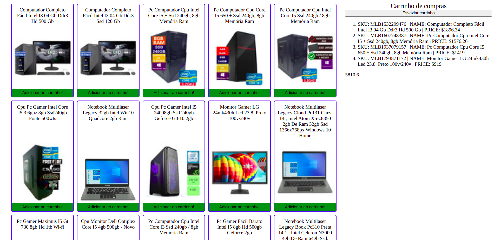

<header>
  <h1>PROJETO SHOPPING CART</h1>  
    
Desenvolvido em HTML, CSS e JavaScript. O projeto foi individual, nele estavamos aprendendo sobre os Fundamentos do Desenvolvimento Web.

</header>

##

<main>
  <h2>O QUE FOI DESENVOLVIDO</h2>
  
O Shopping Cart foi feito utilizando o básico do Desenvolvimento Web.

  
Nele é possível adicionar, remover e visualizar o valor total do carrinho.

  
A base de dados é a API do Mercado Livre com um endpoint específico.

  
  
O layout tem como foco web browser.

</main>

<section>
  <h3>API UTILIZADA</h3>
    <ul>
      <li><a href="https://developers.mercadolivre.com.br/pt_br/api-docs-pt-br">Mercado Livre API</a></li>
    </ul>
</section>

<section>
  <h3>COMO RODAR O SHOPPING CART</h3>
  <ol>
    <li>Clone o repositório.</li>
    <li>Na raiz do projeto utilize o comando <b>npm install</b>.</li>
    <li>Agora rode o arquivo <b>index.html</b>.</li>
  </ol>
</section>

##

<section>
  <h2>CONSIDERAÇÃO FINAL</h2>
  
Este projeto foi criado apenas por razões didáticas, sem nenhum objetivo além desse.

</section>
